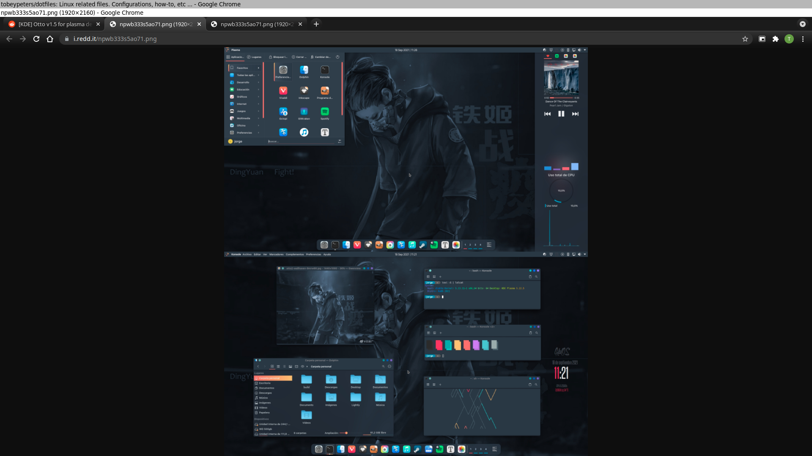
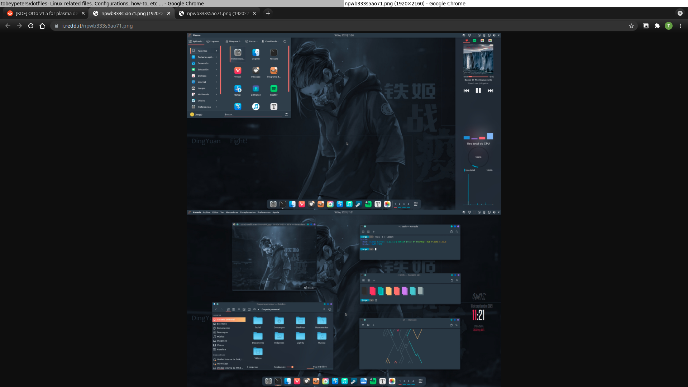
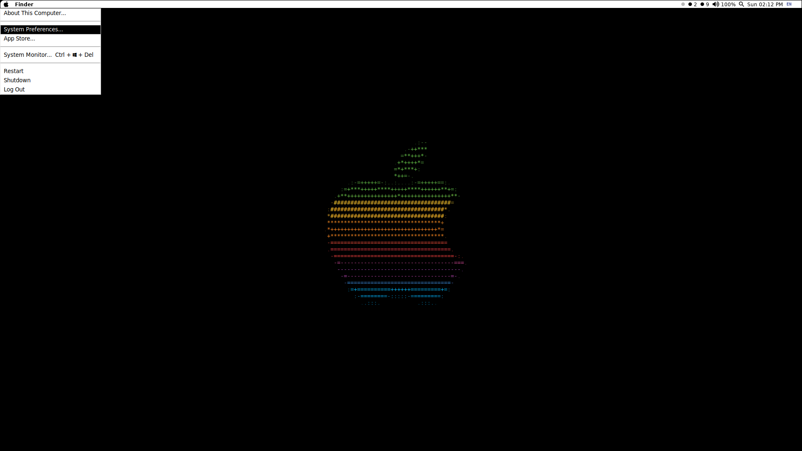
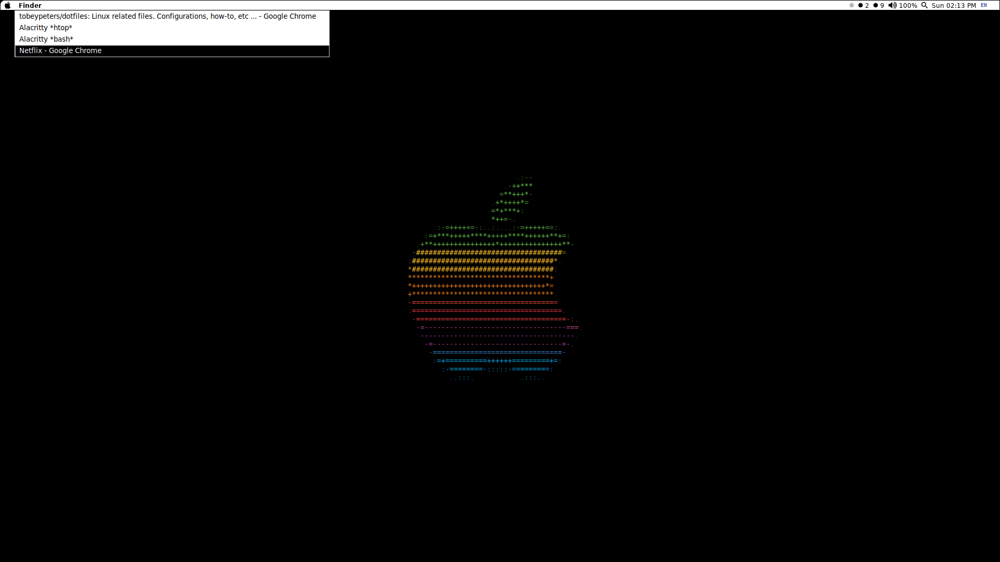
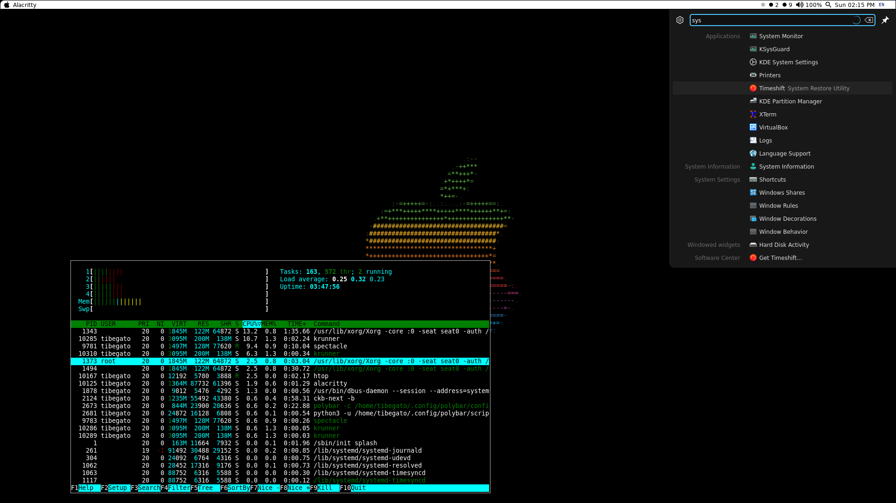
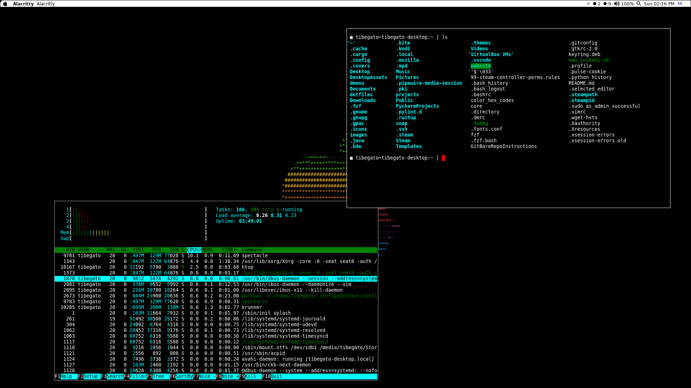
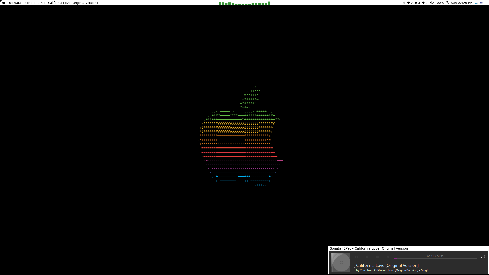
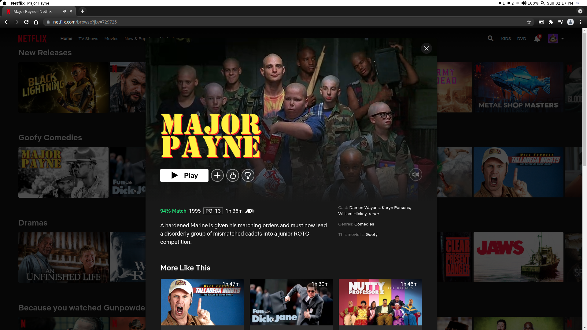

# dotfiles
<b>Linux configuration files</b>

[Xresources](https://github.com/tobeypeters/dotfiles/blob/master/.Xresources) 
[.bashrc](https://github.com/tobeypeters/dotfiles/blob/master/.bashrc) 

<b>Current [i3](https://i3wm.org/) & [polybar](https://github.com/polybar/polybar) rice:</b>

[i3wm configuration](https://github.com/tobeypeters/dotfiles/blob/master/.config/i3/config) 
[polybar configuration](https://github.com/tobeypeters/dotfiles/blob/master/.config/polybar/config.iniE)

<b>Features:</b>

[cycle.py](.config/polybar/scripts/cycle.py)  - i3IPC python script - Allows you to cycle, forward or backward, between open application windows.  Also, can provide an popup menu, used for application switching.

<b>i3 keybindings:</b> 
<i>super + Tab</i> : next window 
<i>super + Shift + Tab</i> : prev window 
<i>super + Ctrl + Tab</i> : display the switcher popup menu 
<i>super + Shift + a</i> : swap the current window "container" with a target window "container" 
<i>super + m</i> : display the system menu 

[window_info.py](.config/polybar/scripts/window_info.py)  - i3IPC python script - Designed with polybar in mind, this script displays the active foreground windows title, classname, or both.  You can supply color values, to format the displayed output. 
[window_info.conf](.config/polybar/scripts/window_info.conf)  - optional configuration file - Contains classnames you want completely ignored by window_info.py and those you want excluded during the title formatting process.

<b>Polybar window_info module "cycle" actions:</b> 
left click - Displays the switcher popup menu 
middle click - Switches to the next application window 
right click - Switches to the previous application window

[generic_popup.py](.config/polybar/scripts/generic_popup.py)  - python script - Generic tkinter popup menu displayer.  You just supply it display items, commands to execute, and if you want tell it where to display, how big to be, etc ... Both cycle.py & window_info.py use this script to display their popup menus.

[sysmenu.py](.config/polybar/scripts/sysmenu.py)  - python script - Custom user-defined system menu, which utilizes generic_popup.py to build it.

[krunner](https://userbase.kde.org/Plasma/Krunner)  - Comes with KDE - Used to "mimick" Mac OS Spotlight

[alacritty](https://github.com/alacritty/alacritty)  - Default terminal emulator

[cava_visualizer.py](https://github.com/tobeypeters/dotfiles/blob/master/.config/polybar/scripts/cava_visualizer.py)  - python script - Audio visualizer, which utilizes cava.  Used to display a bar graph in a polybar module.

[new_install.sh](https://github.com/tobeypeters/dotfiles/blob/master/new_install.sh)  - python script - Pretty much lists all the programs I have installed and their install commands.  (i3, i3ipc, polybar, alacritty) - build / install instructions are not in there.

NOTE: How to setup bare git repository and other instructions files are in this repo also.

Current Style : Mimimick of old school Mac : I'm restricted on what I can do

When in i3 is in stack mode, polybar gets hidden.  Right now, I use the tool [xdo](https://github.com/baskerville/xdo), which is a really nice tool and it does many things.  But, I will probably just switch to xdotool or something else. <b>UPDATE:</b> Awhile back, I was able to switch xdo to polybar-msg. I stil have xdo installed, as it IS a very nice tool to have.

:[split mode]:
  
:[stack mode]:
  
:[tabbed mode]:
  
:[sysmenu]:
  
:[task switcher]:
  
:[krunner]:
  
:[alacritty terminal emulator]:
  
:[cava_visualizer.py]:
  
:[google-chrome is in a sandboxed private session and on it's own dedicated workspace.  Utilizing a PIP chrome extension, I can watch videos in a sticky window.  Being a sticky window, means it stays on whatever workspace I'm working on. ]:
